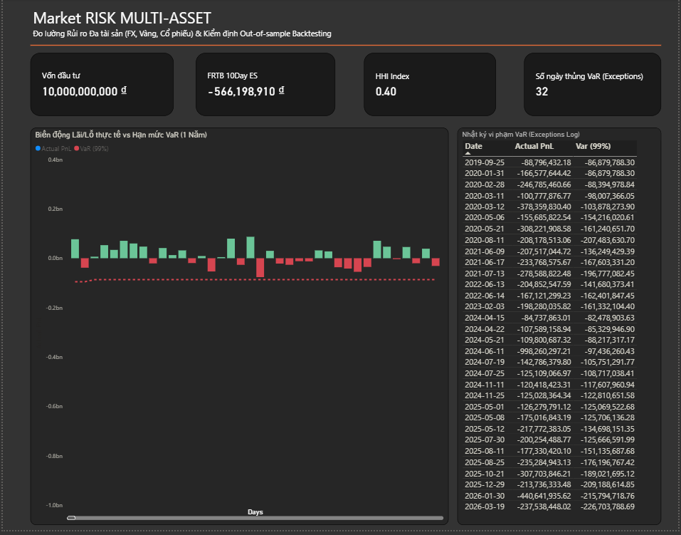
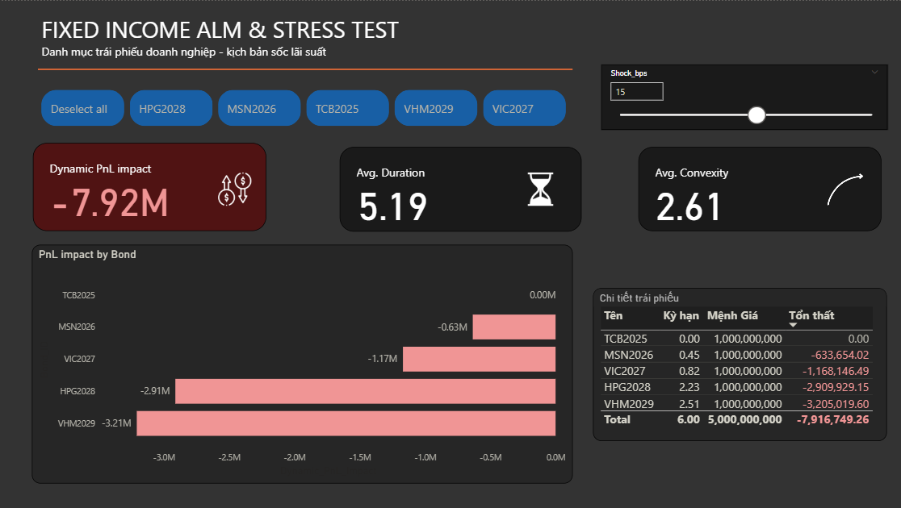
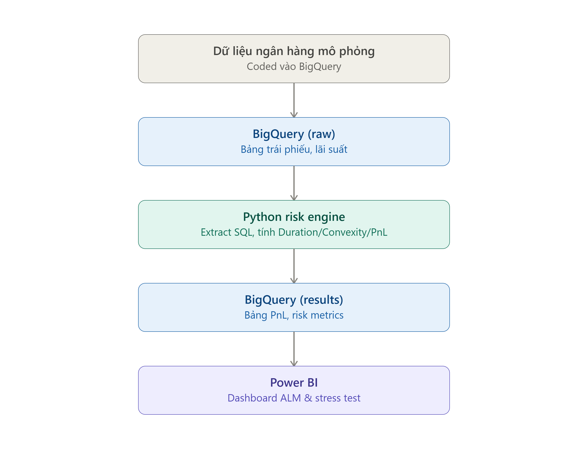

# 🏦 FIXED INCOME ALM & MARKET RISK ENGINE 
*(Hệ thống Lượng hóa Rủi ro Thị trường & Lãi suất sổ Ngân hàng)*

**Author:** Nguyen Manh Cuong - FRM Candidate | Quantitative Risk Analyst  
**Architecture:** ELT Cloud Data Pipeline (Python ➔ Google BigQuery ➔ Power BI DAX)

---

## 🚀 1. EXECUTIVE SUMMARY (Tóm tắt hệ thống)
Hệ thống được thiết kế để tự động hóa việc đo lường hai rủi ro cốt lõi theo chuẩn mực Basel III / FRTB:

1. **Market Risk (Đa tài sản):** Lượng hóa rủi ro đuôi (Tail-risk) bằng các mô hình VaR Nâng cao và thiết lập tỷ lệ phòng vệ (Hedging) bằng Phái sinh.

2. **Fixed Income Risk (IRRBB):** Nội suy Đường cong lợi suất (Yield Curve Bootstrapping), lượng hóa độ nhạy giá (Modified Duration, Convexity), và chạy Stress Test (sốc lãi suất) để đo lường mức sụt giảm vốn chủ sở hữu (**Delta EVE**).

## ⚙️ 2. SYSTEM ARCHITECTURE (Kiến trúc Dữ liệu End-to-End)

Hệ thống vận hành hoàn toàn tự động (Automated EOD Batch) theo luồng:
*   **Extract:** `Python` cào dữ liệu qua API (yfinance, DNSE) và thuật toán Random Walk (Risk-free rates).
*   **Load & Transform (ELT):** Xử lý làm sạch và đẩy (WRITE_TRUNCATE) lên kho Cloud `Google BigQuery`. Sử dụng Advanced SQL (`CROSS JOIN`, `Subquery`) để ghép Sổ cái Trái phiếu (DIM) và Lợi suất (FACT).
*   **Quant Engine:** `Python` xử lý lõi Toán học (DCF, Taylor Expansion) và bắn báo cáo rủi ro ngược lên BigQuery.
*   **Visualize:** `Power BI` (Direct Import) thiết kế Dark Mode Dashboard kết hợp DAX What-if Parameter để giả lập kịch bản Real-time.

## 🧮 3. QUANTITATIVE MODELS (Lõi Toán học Ứng dụng)

### A. Fixed Income Valuation & Sensitivities (Định giá Trái phiếu)
Hệ thống áp dụng phương trình Chiết khấu dòng tiền kỳ hạn phân số (Fractional Period DCF) để bóc tách **Clean Price** và **Accrued Interest**:

$$
PV = \sum_{t=1}^{n} \frac{CF_t}{(1 + \frac{YTM}{f})^{t \times f}}
$$

*(Trong đó: YTM được nội suy tuyến tính từ Risk-free Curve + Z-Spread)*

Đo lường rủi ro thông qua Đạo hàm bậc 1 (Mod. Duration) và Bậc 2 (Convexity):

$$
D_{mod} = \frac{\sum t \cdot CF_t \cdot (1+y)^{-(t+1)}}{PV}
$$

### B. Macro Stress Testing (Kịch bản Sốc lãi suất)
Ứng dụng **Chuỗi Taylor (Taylor Series Expansion)** để định lượng chính xác sự sụt giảm tài sản (PnL Impact) khi có cú sốc vĩ mô $\Delta y$, khắc phục sai số của Duration khi thị trường biến động mạnh:

$$
\frac{\Delta P}{P} \approx -D_{mod} \times \Delta y + \frac{1}{2} \times Convexity \times (\Delta y)^2
$$

### C. Market Risk Metrics (Đo lường rủi ro Đa tài sản)
*   **Cornish-Fisher VaR:** Hiệu chỉnh Z-score bằng Skewness ($S$) và Kurtosis ($K$) để bọc lót rủi ro Thiên nga đen:

$$
Z_{CF} = z + \frac{(z^2 - 1)S}{6} + \frac{(z^3 - 3z)(K - 3)}{24} - \frac{(2z^3 - 5z)S^2}{36}
$$

*   **Stressed Expected Shortfall (FRTB):** Tìm kiếm mức lỗ phần đuôi (Tail-loss) trong cửa sổ 250 ngày tồi tệ nhất của lịch sử.

---
*Mô hình được xây dựng dưới góc nhìn của một Kỹ sư Định lượng, nhằm cung cấp công cụ ra quyết định sắc bén cho Khối Nguồn Vốn và Quản trị Rủi ro (ALM).*
